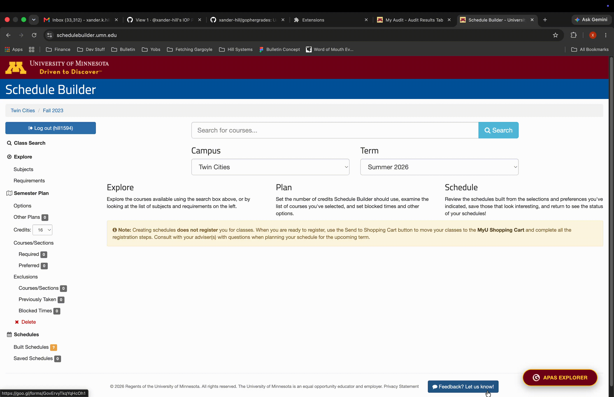

# Gopher Grades (Fork)

> **My primary contribution:** **APAS Explorer** — a feature that synchronizes University of Minnesota APAS degree audits into the Gopher Grades Chrome extension for interactive degree planning.

This repository is a fork of the original **Gopher Grades** Chrome Extension. My work focused on designing and implementing **APAS Explorer**, an end-to-end feature that enables students to import their APAS degree audit, visualize remaining degree requirements, and seamlessly explore eligible courses alongside existing GPA distribution data.

> **Status:** Developed in a fork of Gopher Grades. The feature was completed, tested, and updated to remain compatible with the current uAchieve APAS platform, but was not merged into the upstream repository after project communication concluded.

---

# Demo



---

## Key Features

- Synchronize University of Minnesota APAS degree audits
- Parse legacy APAS HTML into structured requirement data
- Visualize remaining degree requirements interactively
- Explore eligible courses alongside GPA distribution data
- Cache synchronized audits locally using Chrome Storage

---

# My Contribution

I independently designed and implemented the complete APAS Explorer workflow, including:

- APAS synchronization from the University of Minnesota audit system
- Legacy DOM parsing across nested HTML structures and iframes
- Requirement extraction and normalization into structured application data
- Browser storage synchronization using `chrome.storage`
- Interactive requirement visualization
- State-aware synchronization workflow and user feedback
- Integration with the existing course and GPA exploration experience
- Compatibility updates for changes to the University's APAS platform

The remainder of the extension—including historical GPA data, Schedule Builder integration, and other existing functionality—originated from the original Gopher Grades project.

---

# Technical Highlights

### Degree Audit Parsing

Developed a resilient client-side parsing pipeline capable of extracting meaningful academic requirements from deeply nested legacy APAS HTML. The parser normalizes inconsistent markup and transforms unstructured audit reports into structured application data suitable for interactive exploration.

### Browser Extension Integration

Implemented a Chrome Extension content-script workflow that injects synchronization controls into the APAS interface, parses the current audit, persists results using browser storage, and integrates seamlessly with the existing extension.

### User Experience

Designed a lightweight synchronization workflow with responsive UI feedback, loading states, and browser storage to provide a fast, intuitive degree-planning experience.

### User-Centered Design

APAS Explorer originated from user experience research conducted for a university UI/UX design course, translating observed student planning workflows into an integrated degree-planning feature.

---

# Architecture Overview

```text
University APAS Audit
          │
          ▼
Content Script Injection
          │
          ▼
APAS Parsing Engine
          │
          ▼
Requirement Normalization
          │
          ▼
chrome.storage
          │
          ▼
APAS Explorer Interface
          │
          ▼
Course & GPA Exploration
```

---

# Running Locally

## Prerequisites

- Google Chrome with **Developer Mode** enabled

## Installation

```bash
git clone <repository-url>
```

1. Open `chrome://extensions`.
2. Enable **Developer Mode**.
3. Select **Load unpacked**.
4. Choose the `chrome-extension` directory.
5. Navigate to the University of Minnesota APAS audit page.
6. Click **Sync APAS** to import your audit into Gopher Grades.

---

# Technologies

- JavaScript (ES6)
- Chrome Extensions API
- HTML / CSS
- DOM Parsing
- Browser Storage APIs

---

# Original Project & Attribution

This repository is a fork of the original **Gopher Grades** project.

**Original repository:**
https://github.com/samyok/gophergrades

The original project provides GPA distribution data and academic planning tools for University of Minnesota students. This fork showcases my implementation of **APAS Explorer** while preserving and building upon the original project.

Please refer to the original repository for the complete project history and contributions from the original development team.
